# Centria ERP & Ticketing Platform


**Centria** este o platformă web modernă de tip SaaS (B2G/B2B) concepută pentru a eficientiza fluxul de lucru și comunicarea dintre instituțiile publice (Primării) și entitățile private (Furnizori de servicii). Aplicația centralizează gestiunea cererilor de intervenție, oferind transparență totală, rapoarte automate și asistență bazată pe Inteligență Artificială.
---
## 📸 Galerie Interfață

### 🔐 Autentificare & Securitate
<div align="center">
  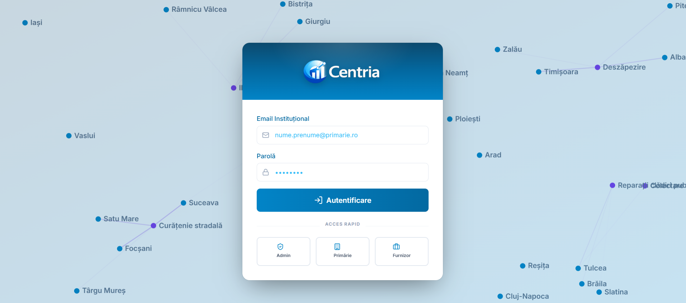
</div>

### 📊 Panouri de Control (Dashboards)
<table>
  <tr>
    <td width="50%" align="center">
      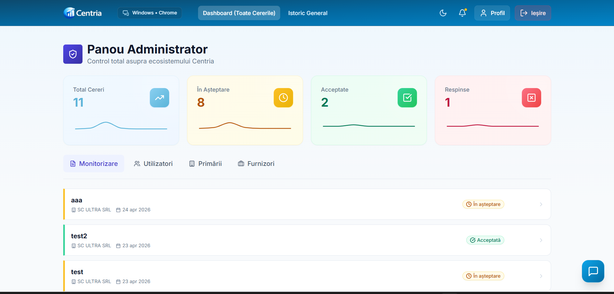
      <br/><b>Panou Administrator</b>
    </td>
    <td width="50%" align="center">
      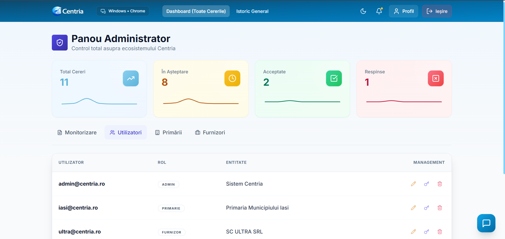
      <br/><b>Utilizatori (Panel 1)</b>
    </td>
  </tr>
  <tr>
    <td align="center">
      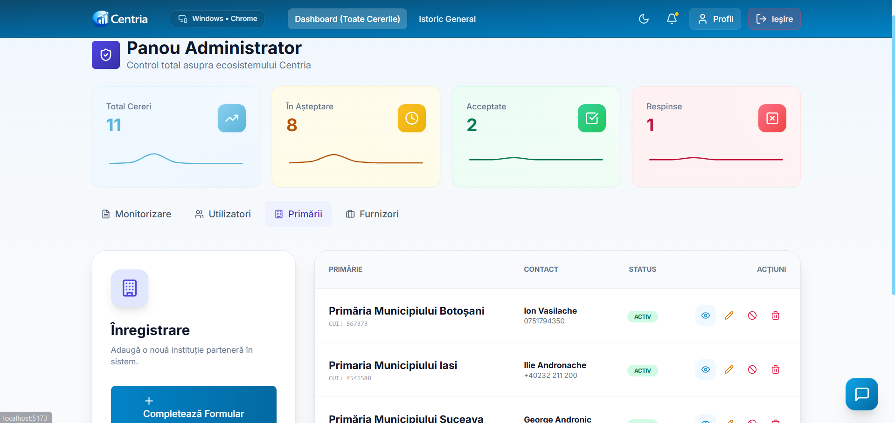
      <br/><b>Primării (Panel 2)</b>
    </td>
    <td align="center">
      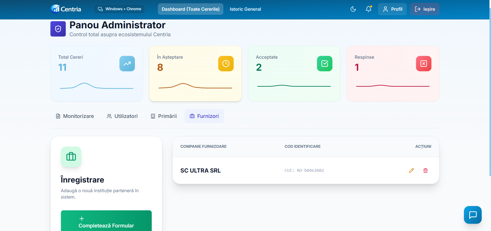
      <br/><b>Furnizori (Panel 3)</b>
    </td>
  </tr>
</table>

### 🤖 Asistent Virtual (AI Chatbot)
<table>
  <tr>
    <td width="50%" align="center">
      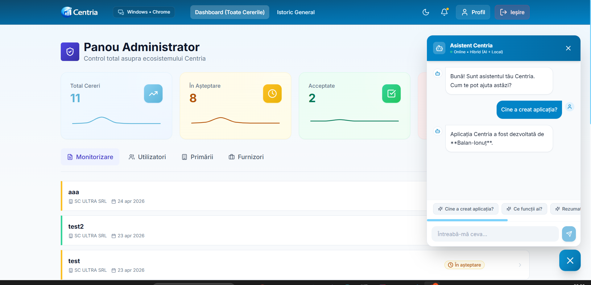
      <br/><b>Sugestii și Răspunsuri Rapide</b>
    </td>
    <td width="50%" align="center">
      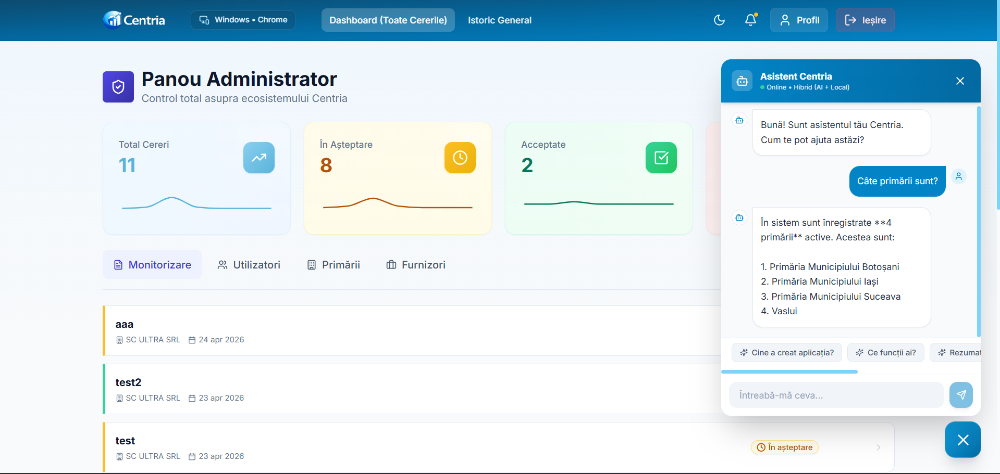
      <br/><b>Conversație AI Inteligentă</b>
    </td>
  </tr>
</table>

### 📄 Export Enterprise (PDF & Excel)
<table>
  <tr>
    <td width="50%" align="center">
      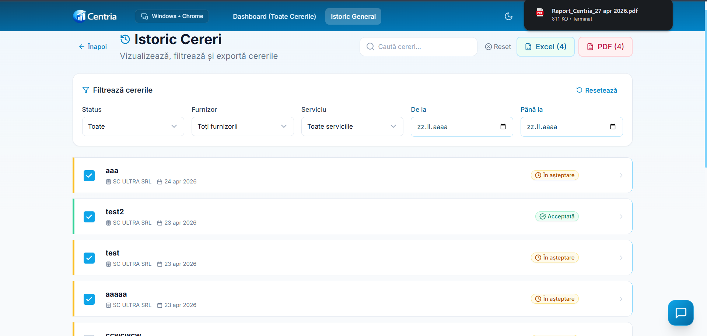
      <br/><b>Selecție și Export Date</b>
    </td>
    <td width="50%" align="center">
      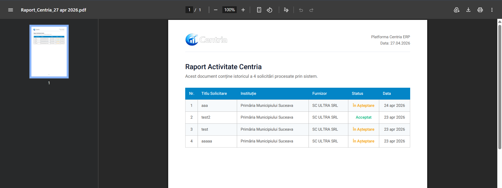
      <br/><b>Raport PDF</b>
    </td>
  </tr>
</table>

### 📧 Sistem Suport & Monitorizare
<table>
  <tr>
    <td width="33%" align="center">
      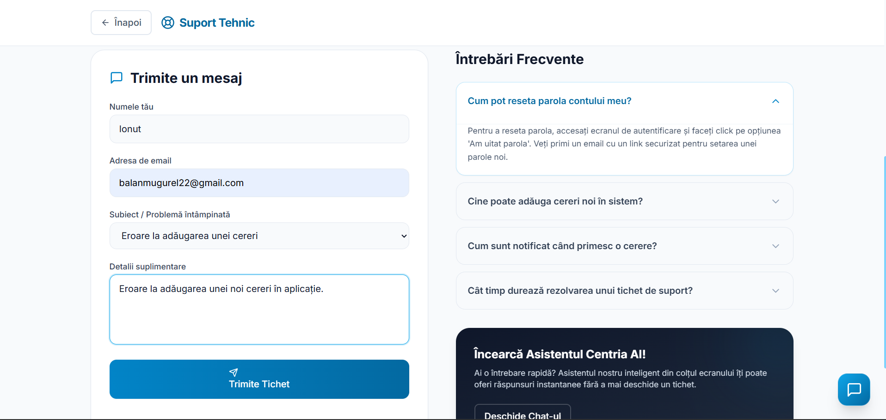
      <br/><b>Creare Tichet Suport</b>
    </td>
    <td width="33%" align="center">
      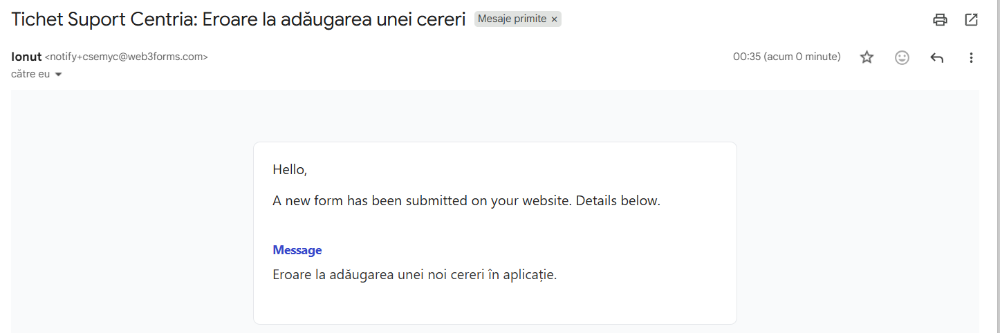
      <br/><b>Email Primit în Inbox</b>
    </td>
    <td width="33%" align="center">
      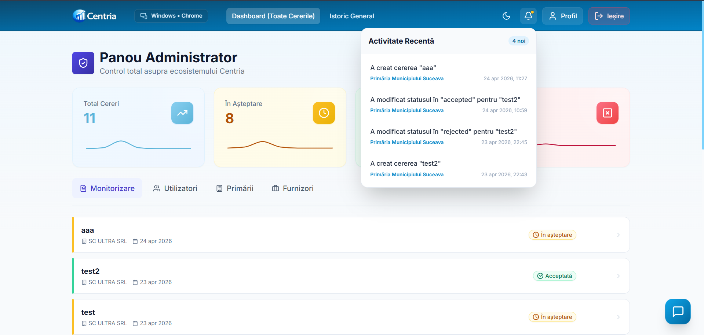
      <br/><b>Istoric Activitate (JSON Logs)</b>
    </td>
  </tr>
</table>

## 🗺️ Diagrama de Ansamblu (High-Level Overview) (Use Case)

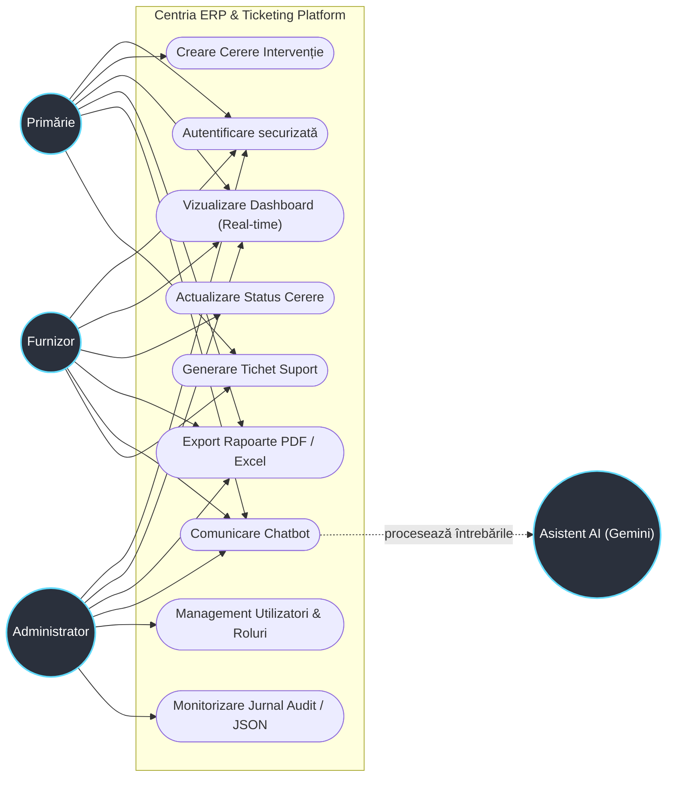
### 🏛️ Fluxul de Lucru: Modul Primărie

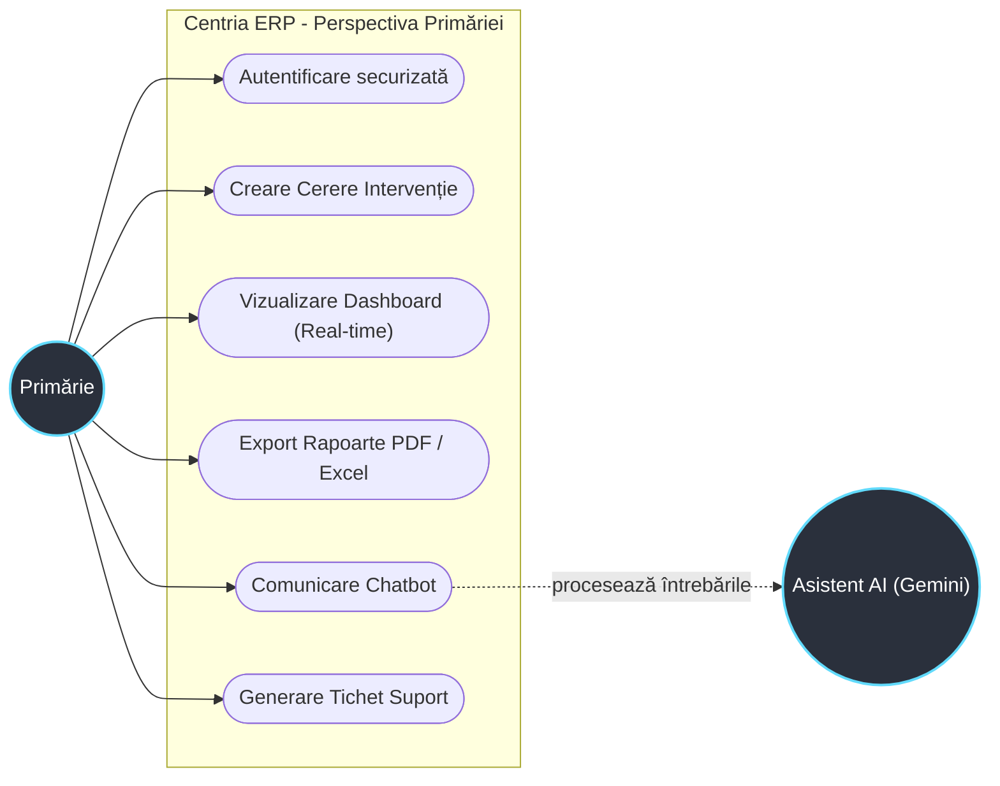
## 🚀 Funcționalități Principale

### 🔐 Management Avansat al Accesului (RBAC)
* **3 Roluri Distincte:** Administrator, Primărie și Furnizor.
* **Securitate la nivel de rând (RLS):** Politici stricte în baza de date (PostgreSQL) care garantează că fiecare utilizator vede doar datele la care are dreptul legal.

### ⚡ Actualizări în Timp Real (Real-time)
* Integrare cu **Supabase Realtime** pentru sincronizarea instantanee a statusurilor cererilor. Orice modificare făcută de un furnizor este vizibilă instantaneu în dashboard-ul primăriei, fără reîncărcarea paginii.

### 🤖 Asistent Virtual Inteligent (Hybrid AI)
* Chatbot integrat cu **Gemini AI** prin Supabase Edge Functions.
* **Context-Aware:** Asistentul utilizează un "System Prompt" dinamic care restrânge informațiile oferite în funcție de rolul și permisiunile utilizatorului autentificat.
* Logică hibridă pentru optimizarea costurilor și viteză de răspuns.

### 📄 Module de Export Enterprise
* **Export PDF Profesional:** Generat pe client cu suport complet pentru diacritice (fonturi Roboto preîncărcate), logo custom și formatare tabelară.
* **Export Excel:** Generare de fișiere `.xlsx` formatate pentru analiză de date folosind librăria `XLSX`.
* **Selecție Manuală:** Posibilitatea de a exporta doar cererile selectate individual prin checkbox-uri.

### 🎨 UI/UX și Performanță
* **Interfață Adaptivă:** Design complet responsive realizat cu Tailwind CSS.
* **Visual FX:** Fundal animat complex generat prin API-ul HTML5 Canvas (rețea de noduri interconectate).
* **Dark Mode:** Suport nativ pentru modul întunecat/luminos cu persistență locală.
* **Animații:** Tranziții fluide între pagini și modale folosind Framer Motion.

---

## 🛠️ Stack Tehnologic

* **Frontend:** React 18, TypeScript, Vite.
* **Backend & Auth:** Supabase (PostgreSQL).
* **Stilizare:** Tailwind CSS, Lucide React (iconițe).
* **AI:** Google Gemini API.
* **Librării Export:** jsPDF, jspdf-autotable, XLSX.
* **Monitorizare:** Plugin custom Vite pentru salvarea logurilor de activitate în format JSON (local).

---

## 📦 Instalare și Configurare

1. **Clonare Repository:**
   ```bash
   git clone [https://github.com/reiner-f/scty.git](https://github.com/reiner-f/scty.git)
   cd scty
2. **Instalare Dependențe:**
    ```bash
    npm install
3. **Configurare Variabile de Mediu:**
    Creați un fișier .env în rădăcina proiectului și adăugați cheile necesare:
    ```bash
    VITE_SUPABASE_URL=your_supabase_url
    VITE_SUPABASE_ANON_KEY=your_supabase_anon_key
    VITE_WEB3FORMS_ACCESS_KEY=your_web3forms_key
4. **Rulare în Mod Dezvoltare:**
    ```bash
    npm run dev

### 🛡️ Securitate și Audit ##
**Activity Logging:** Orice acțiune critică (creare cerere, modificare status) este interceptată de un plugin middleware personalizat și salvată într-un jurnal de audit local.
**Environment Safety:** Cheile sensibile sunt gestionate prin variabile de mediu, nefiind expuse în codul sursă urcat pe GitHub *(via .gitignore)*.
## 👨‍💻 Autor

Bălan Mugurel - Software Developer

* [LinkedIn](https://www.linkedin.com/in/ionu%C8%9B-balan/)
* [GitHub](https://github.com/reiner-f)

## 📜 Licență

Acest proiect este dezvoltat în scop academic pentru cursul „Dezvoltarea Aplicațiilor Web”. Toate drepturile rezervate autorului.
## 📂 Structura Proiectului ##

```text
src/
├── components/      # Componente reutilizabile (UI, Modale, Dashboards)
├── context/         # Managementul stării globale (AppContext)
├── hooks/           # Hook-uri personalizate (useLocalStorage, etc.)
├── lib/             # Configurări biblioteci externe (Supabase)
├── pages/           # Paginile principale (History, Dashboard, Login)
├── services/        # Logica de business (API calls, Exporturi, AI)
├── types/           # Definiții TypeScript (Interfețe, Enum-uri)
└── utils/           # Funcții ajutătoare (formatare date, helper-i CSS) 

